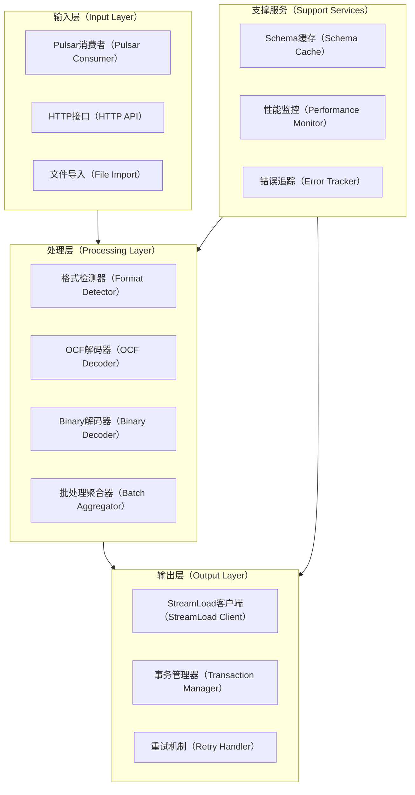
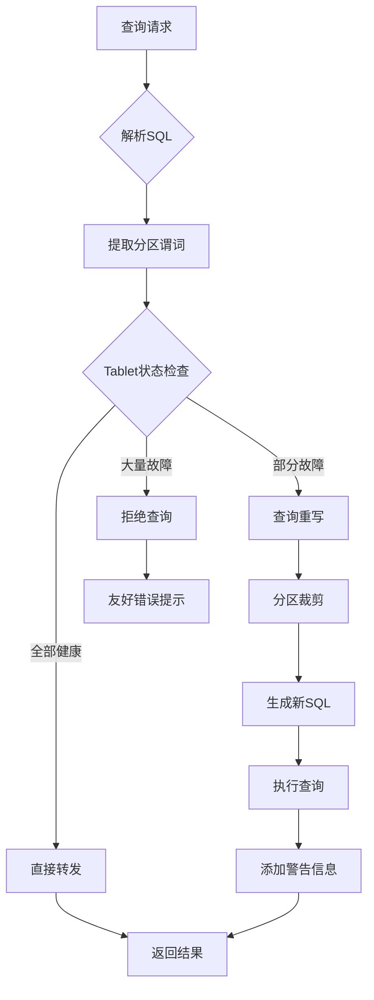
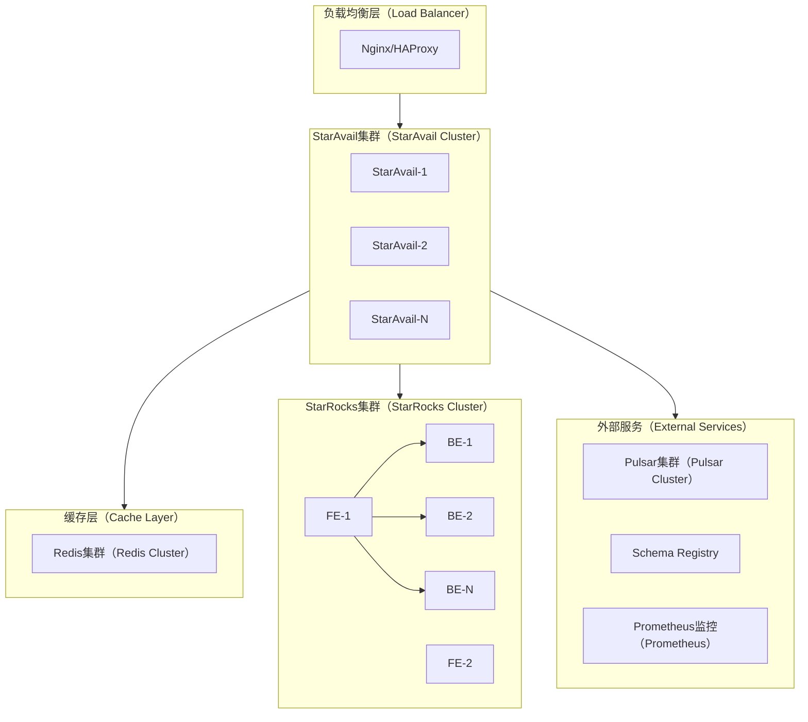
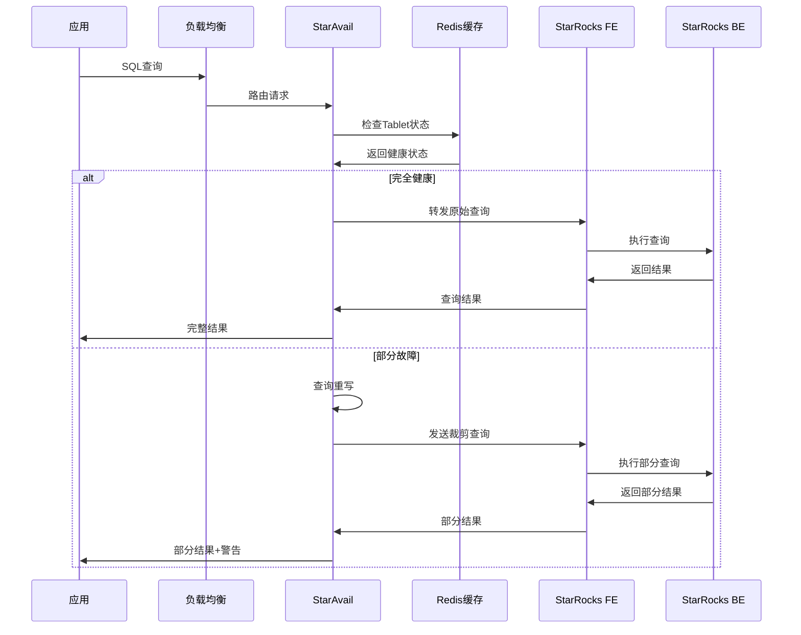
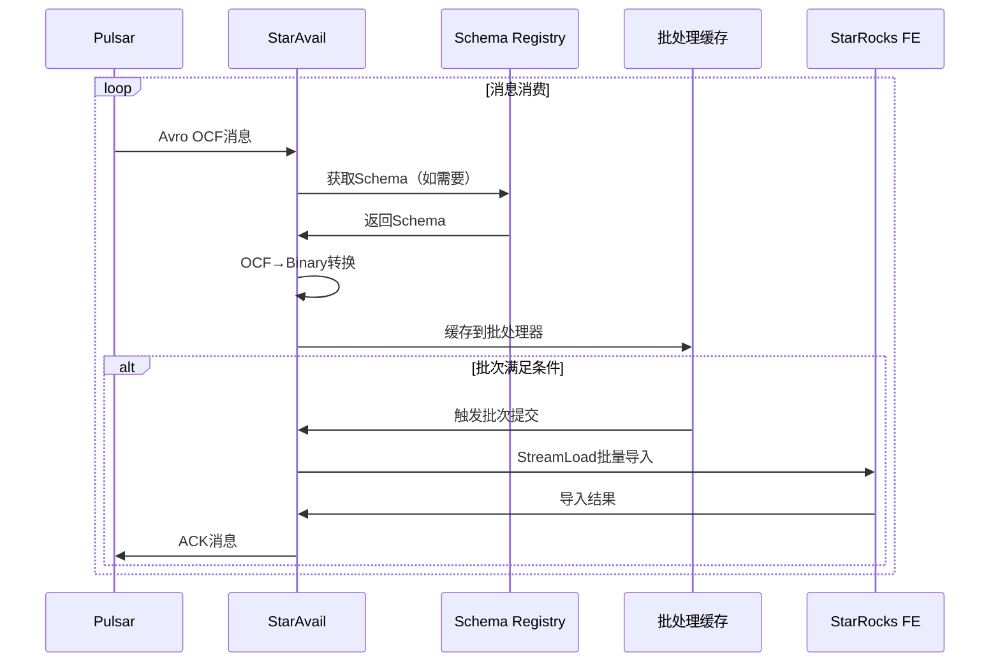

# StarAvail 架构设计文档

## 概述

StarAvail 是一个专为 StarRocks 数据仓库设计的高性能代理服务，致力于解决单副本部署下的可用性问题和数据摄入性能瓶颈。本文档详细阐述了系统的架构设计、技术决策和实现方案。

## 领域问题分析

### 单副本可用性问题

StarRocks 采用分区→分桶→Tablet 的三级数据分布方式，每个分区内的数据根据分桶列进一步划分为多个 Tablet。在单副本（num_replicas=1）部署模式下，每个 Tablet 仅在一个 BE 节点上存储，这种设计虽然节省存储成本，但带来了严重的可用性风险：

- **单点故障风险**：任意 BE 节点宕机导致其上所有 Tablet 不可用
- **全有或全无语义**：StarRocks FE 发现任一目标 Tablet 不可用时立即中断整个查询
- **数据丢失风险**：单副本模式下 Tablet 丢失等于数据片段永久丢失

### 数据摄入性能瓶颈

当前 Pulsar → StarRocks 数据摄入链路存在多重结构性问题：

1. **格式兼容性问题**：Avro OCF 格式包含完整schema定义和数据块，而 StarRocks 原生只支持 Avro Binary 格式
2. **解码阻塞问题**：OCF 格式需要完整文件才能解码，无法支持流式处理
3. **导入效率问题**：StreamLoad 同步机制频繁生成小文件，加重 compaction 负担
4. **链路背压问题**：compaction 调度不当会影响导入性能，进而影响上游消息确认

## 解决方案架构

### 整体架构设计

```mermaid
graph TB
    %% 客户端层
    subgraph CL[客户端层（Client Layer）]
        A1[业务应用（Business Apps）]
        A2[数据管道（Data Pipelines）]
        A3[分析工具（Analytics Tools）]
    end

    %% StarAvail 代理层
    subgraph SA[StarAvail 代理层（Proxy Layer）]
        B1[API网关（API Gateway）]
        B2[查询路由器（Query Router）]
        B3[数据摄入引擎（Ingestion Engine）]
        B4[健康检查器（Health Monitor）]
    end

    %% 核心服务层
    subgraph CS[核心服务层（Core Services）]
        C1[部分可用性管理器（Partial Availability Manager）]
        C2[Tablet映射缓存（Tablet Mapping Cache）]
        C3[Schema注册中心客户端（Schema Registry Client）]
        C4[性能优化引擎（Performance Engine）]
    end

    %% 外部依赖
    subgraph ED[外部依赖（External Dependencies）]
        D1[StarRocks集群（StarRocks Cluster）]
        D2[Pulsar消息队列（Pulsar MQ）]
        D3[Schema注册中心（Schema Registry）]
        D4[监控系统（Monitoring）]
    end

    %% 连接关系
    CL --> SA
    SA --> CS
    CS --> ED
    B1 --> B2 
    B1 --> B3
    B2 --> C1
    B3 --> C3
    B4 --> C2
    C1 --> D1
    C3 --> D3
    B3 --> D2
````

### 核心组件设计

#### 1. 部分可用性管理器

```mermaid
sequenceDiagram
    participant Client as 客户端
    participant Router as 查询路由器
    participant PAM as 部分可用性管理器
    participant Cache as Tablet映射缓存
    participant SR as StarRocks

    Client->>Router: SQL查询请求
    Router->>PAM: 检查查询范围
    PAM->>Cache: 获取Tablet状态
    Cache->>PAM: 返回健康/故障Tablet列表
    
    alt 所有Tablet健康
        PAM->>SR: 直接转发查询
        SR->>PAM: 返回完整结果
        PAM->>Client: 返回完整结果
    else 部分Tablet故障
        PAM->>PAM: 裁剪查询范围
        PAM->>SR: 发送裁剪后查询
        SR->>PAM: 返回部分结果
        PAM->>Client: 返回部分结果+警告信息
    else 关键Tablet故障
        PAM->>Client: 返回友好错误提示
    end
```

#### 2. 数据摄入引擎架构



### 技术栈与依赖

| 组件       | 技术选型                      | 版本要求    | 说明                           |
| -------- | ------------------------- | ------- | ---------------------------- |
| 核心语言     | Go                        | 1.20.2+ | 高性能并发处理                      |
| Web框架    | Gin                       | v1.9.1  | 轻量级HTTP服务器                   |
| 数据库驱动    | go-sql-driver/mysql       | v1.7.1  | StarRocks MySQL协议兼容          |
| 消息队列     | pulsar-client-go          | v0.11.0 | Pulsar官方Go客户端                |
| Avro处理   | linkedin/goavro           | v2.12.0 | Avro编解码支持                    |
| Schema注册 | srclient                  | v0.6.0  | Confluent Schema Registry客户端 |
| 缓存       | go-redis/redis            | v9.0.5  | 分布式缓存支持                      |
| 监控       | prometheus/client_golang | v1.16.0 | 指标收集与暴露                      |
| 日志       | sirupsen/logrus           | v1.9.3  | 结构化日志记录                      |
| 配置管理     | spf13/viper               | v1.16.0 | 配置文件处理                       |

### 性能优化策略

#### 1. 查询性能优化



#### 2. 数据摄入优化

| 优化维度     | 策略      | 目标指标         | 实现方式                    |
| -------- | ------- | ------------ | ----------------------- |
| 批处理优化    | 动态批大小调整 | 减少小文件生成      | 基于数据量和时间窗口自适应调整         |
| 并发控制     | 多协程并行处理 | 提升吞吐量        | Worker Pool + Channel模式 |
| 内存管理     | 流式处理    | 降低内存占用       | 避免大文件缓存，实现流式解码          |
| 错误处理     | 熔断与重试   | 提高系统稳定性      | 指数退避 + 熔断器模式            |
| Schema缓存 | LRU缓存机制 | 减少Registry访问 | 内存缓存 + TTL过期策略          |

### 部署架构



### 数据流设计

#### 1. 查询数据流



#### 2. 数据摄入流



### 监控与可观测性设计

#### 1. 关键指标定义

| 指标类型  | 指标名称                  | 含义           | 阈值      |
| ----- | --------------------- | ------------ | ------- |
| 可用性指标 | tablet_health_ratio | 健康Tablet比例   | > 85%   |
| 性能指标  | query_latency_p99   | 查询延迟P99      | < 200ms |
| 吞吐指标  | ingestion_eps        | 数据摄入EPS      | > 10000 |
| 错误指标  | error_rate           | 错误率          | < 1%    |
| 资源指标  | memory_usage         | 内存使用率        | < 80%   |
| 业务指标  | compaction_score     | Compaction分数 | < 100   |

#### 2. 日志体系设计

```mermaid
graph LR
    %% 日志来源
    subgraph LS[日志来源（Log Sources）]
        A1[应用日志（App Logs）]
        A2[访问日志（Access Logs）]
        A3[错误日志（Error Logs）]
        A4[性能日志（Perf Logs）]
    end

    %% 日志处理
    subgraph LP[日志处理（Log Processing）]
        B1[结构化格式（JSON）]
        B2[日志级别（Levels）]
        B3[上下文信息（Context）]
        B4[链路追踪（Tracing）]
    end

    %% 日志输出
    subgraph LO[日志输出（Log Output）]
        C1[控制台输出（Console）]
        C2[文件输出（File）]
        C3[远程收集（Remote）]
    end

    LS --> LP
    LP --> LO
```



## 实现计划

### 代码架构设计

```
staravail/
├── cmd/                          # 应用程序入口
│   └── staravail/
│       └── main.go              # 主程序入口
├── internal/                     # 内部包，不对外暴露
│   ├── app/                     # 应用层
│   │   ├── query/               # 查询应用服
│   │   │   ├── service.go          # 查询应用服务实现
│   │   └── ingestion/              # 数据摄入应用服务
│   │       ├── service.go          # 数据摄入应用服务实现
│   ├── core/                       # 核心业务逻辑层
│   │   ├── domain/                 # 领域模型
│   │   │   ├── query/              # 查询领域
│   │   │   │   ├── models.go       # 查询相关模型
│   │   │   │   ├── repository.go   # 查询仓储接口
│   │   │   │   ├── service.go      # 查询领域服务
│   │   │   ├── tablet/             # Tablet管理领域
│   │   │   │   ├── models.go       # Tablet模型
│   │   │   │   ├── repository.go   # Tablet仓储接口
│   │   │   │   ├── service.go      # Tablet领域服务
│   │   │   └── ingestion/          # 数据摄入领域
│   │   │       ├── models.go       # 摄入相关模型
│   │   │       ├── repository.go   # 摄入仓储接口
│   │   │       ├── service.go      # 摄入领域服务
│   │   └── ports/                  # 端口定义（接口）
│   │       ├── http.go             # HTTP端口接口
│   │       ├── repository.go       # 仓储端口接口
│   │       └── services.go         # 服务端口接口
│   ├── infrastructure/             # 基础设施层
│   │   ├── cache/                  # 缓存实现
│   │   │   ├── redis.go           # Redis缓存实现
│   │   ├── database/              # 数据库实现
│   │   │   ├── starrocks.go       # StarRocks客户端
│   │   ├── messaging/             # 消息队列实现
│   │   │   ├── pulsar.go          # Pulsar客户端
│   │   ├── schema/                # Schema Registry实现
│   │   │   ├── registry.go        # Schema Registry客户端
│   │   └── monitoring/            # 监控实现
│   │       ├── metrics.go         # 指标收集

│   ├── interfaces/                # 接口适配器层
│   │   ├── http/                  # HTTP接口实现
│   │   │   ├── handlers/          # HTTP处理器
│   │   │   │   ├── query.go       # 查询处理器
│   │   │   │   ├── ingestion.go   # 摄入处理器
│   │   │   │   ├── health.go      # 健康检查处理器
│   │   │   ├── middleware/        # HTTP中间件
│   │   │   │   ├── auth.go        # 认证中间件
│   │   │   │   ├── cors.go        # CORS中间件
│   │   │   │   ├── logging.go     # 日志中间件
│   │   │   │   ├── metrics.go     # 指标中间件
│   │   │   │   └── recovery.go    # 恢复中间件
│   │   │   ├── router.go          # 路由配置
│   │   │   └── server.go          # HTTP服务器
│   │   └── grpc/                  # gRPC接口实现（可选）
│   │       ├── handlers/          # gRPC处理器
│   │       └── server.go          # gRPC服务器
│   ├── common/                    # 通用包
│   │   ├── config/                # 配置管理
│   │   │   ├── config.go          # 配置结构定义
│   │   │   └── loader.go          # 配置加载器
│   │   ├── logger/                # 日志管理
│   │   │   ├── logger.go          # 日志接口和实现
│   │   ├── errors/                # 错误定义
│   │   │   └── errors.go          # 统一错误定义
│   │   ├── types/                 # 通用类型
│   │   │   ├── enum/              # 枚举类型
│   │   │   │   └── enum.go        # 全局枚举定义
│   │   │   ├── dto/               # 数据传输对象
│   │   │   │   ├── query.go       # 查询DTO
│   │   │   │   └── ingestion.go   # 摄入DTO
│   │   │   └── models/            # 通用模型
│   │   │       └── common.go      # 通用模型定义
│   │   └── utils/                 # 工具函数
│   │       ├── sql.go             # SQL工具函数
│   │       ├── avro.go            # Avro工具函数
│   │       ├── time.go            # 时间工具函数
│   │       └── validation.go      # 验证工具函数
│   └── performance/               # 性能优化模块
│       ├── optimizer.go           # 性能优化器
│       ├── cache.go               # 性能缓存
│       └── benchmark_test.go      # 性能基准测试
├── pkg/                          # 公共包，可对外暴露
│   ├── client/                   # 客户端SDK
│   │   ├── staravail.go         # StarAvail客户端
│   └── api/                      # API定义
│       ├── v1/                   # API v1版本
│       │   ├── query.go          # 查询API定义
│       │   └── ingestion.go      # 摄入API定义
│       └── types/                # API类型定义
│           └── common.go         # 通用API类型
├── go.mod                       # Go模块定义
├── Makefile                     # 构建工具
├── LICENSE                      # 许可证
└── .gitignore                   # Git忽略文件
```