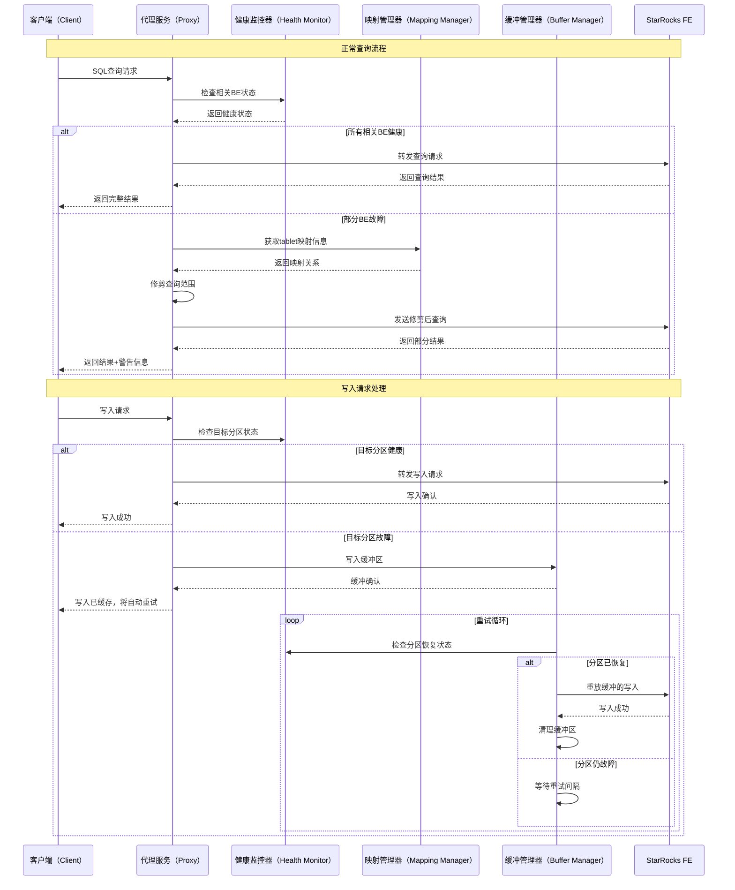
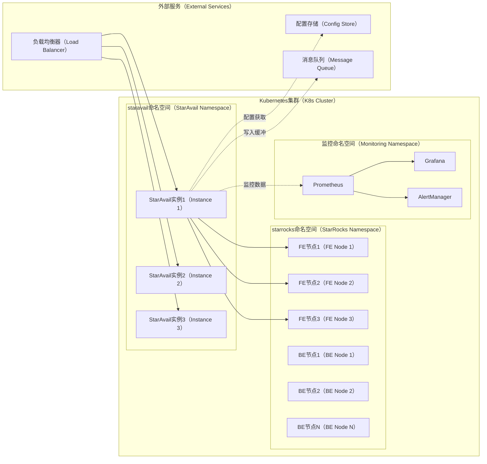
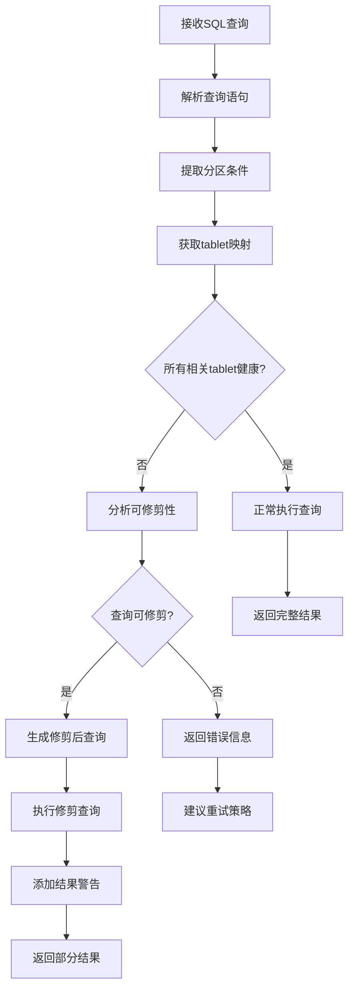
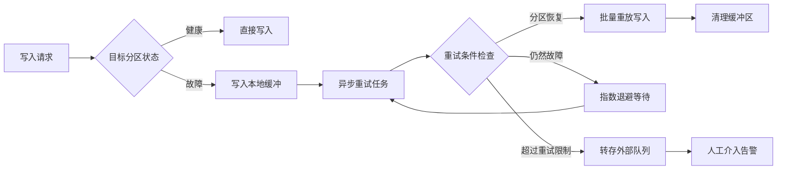
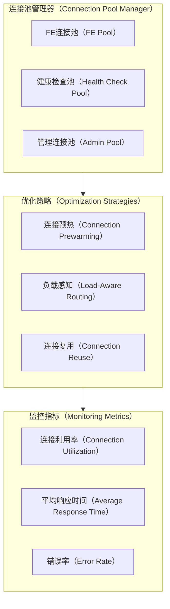
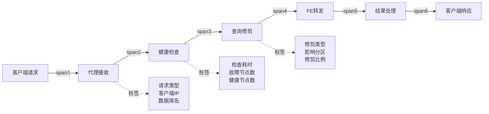

# StarAvail 架构设计文档

## 1. 概述

StarAvail 是一个专为 StarRocks 单副本部署场景设计的智能高可用代理服务。本文档详细阐述了 StarAvail 的架构设计、技术选型、实现方案以及部署策略。

## 2. 问题域分析

### 2.1 DFX 问题全景

在现代数据仓库场景中，StarRocks 作为高性能分析数据库被广泛采用。然而，在单副本部署模式下，系统面临以下关键挑战：

#### 2.1.1 可用性（Availability）问题
- **tablet 级故障影响整表**：单个 BE 节点故障导致该节点上所有 tablet 不可用，进而影响整张表的查询和写入
- **"全或无"语义限制**：StarRocks 原生的完整性检查机制在发现任一 tablet 不可用时立即终止整个操作
- **业务连续性中断**：即使查询仅涉及健康分区，也会因为表级检查失败而无法执行

#### 2.1.2 数据完整性（Data Integrity）问题  
- **数据丢失风险**：单副本模式下 tablet 故障等同于数据永久丢失
- **写入失败累积**：BE 故障期间的写入请求全部失败，可能导致数据缺失
- **恢复期数据不一致**：节点恢复后需要复杂的数据补齐操作

#### 2.1.3 性能（Performance）问题
- **故障检测延迟**：依赖 StarRocks 内部故障检测机制，响应时间较长  
- **资源利用率低**：健康节点资源无法有效利用，整体吞吐量下降
- **连接资源浪费**：应用层连接在故障期间无法复用，增加连接建立开销

#### 2.1.4 可观测性（Observability）问题
- **故障定位困难**：缺乏细粒度的 tablet 级监控和告警
- **影响范围不明**：无法快速判断故障影响的具体业务范围
- **恢复进度不透明**：缺乏恢复过程的可视化监控

### 2.2 解决方案全景

StarAvail 通过引入智能代理层，提供了全方位的解决方案：

#### 2.2.1 智能路由与降级
```mermaid
graph TD
    %% 智能路由决策流程
    A[客户端请求] --> B{请求类型判断}
    B -->|查询请求| C[分析查询范围]
    B -->|写入请求| D[分析目标分区]
    
    C --> E{涉及故障tablet?}
    E -->|是| F[查询修剪策略]
    E -->|否| G[正常路由到FE]
    
    F --> H{修剪后可执行?}
    H -->|是| I[执行部分查询]
    H -->|否| J[返回友好错误]
    
    D --> K{目标分区健康?}
    K -->|是| G
    K -->|否| L[写入缓冲区]
    
    I --> M[返回部分结果+警告]
    J --> N[建议重试时间]
    L --> O[异步重试机制]
````

#### 2.2.2 状态感知与监控

* **多维度健康检查**：BE 节点、tablet 状态、网络连通性的综合监控
* **智能缓存机制**：tablet-to-BE 映射关系的高效缓存与更新策略
* **预测性故障检测**：基于历史模式的故障预测与提前切换

#### 2.2.3 数据保护机制

* **写入缓冲与重试**：故障期间写入数据的临时存储与自动重试
* **事务一致性保障**：跨分区事务的一致性检查与回滚机制
* **数据校验与修复**：节点恢复后的数据完整性校验

## 3. 总体架构设计

### 3.1 系统架构图

```mermaid
graph TB
    %% 系统整体架构
    subgraph APP[应用层（Application Layer）]
        A1[业务应用（Business Apps）]
        A2[数据管道（Data Pipelines）]
        A3[分析工具（Analytics Tools）]
    end

    subgraph PROXY[StarAvail代理层（Proxy Layer）]
        P1[负载均衡器（Load Balancer）]
        P2[协议处理器（Protocol Handler）]
        P3[智能路由器（Smart Router）]
        P4[状态管理器（State Manager）]
    end

    subgraph CORE[核心服务层（Core Services）]
        C1[健康监控（Health Monitor）]
        C2[映射管理器（Mapping Manager）]
        C3[缓冲管理器（Buffer Manager）]
        C4[性能优化器（Performance Optimizer）]
    end

    subgraph INFRA[基础设施层（Infrastructure）]
        I1[配置中心（Config Center）]
        I2[监控告警（Monitoring & Alerting）]
        I3[日志追踪（Logging & Tracing）]
        I4[存储适配器（Storage Adapters）]
    end

    subgraph SR[StarRocks集群（StarRocks Cluster）]
        SR1[FE节点（Frontend Nodes）]
        SR2[BE节点（Backend Nodes）]
    end

    APP --> PROXY
    PROXY --> CORE
    CORE --> INFRA
    PROXY --> SR
    CORE --> SR

    %% 数据流向
    A1 -.->|SQL查询/写入| P1
    P1 --> P2
    P2 --> P3
    P3 --> C1
    C1 --> SR1
    P3 --> SR1
```

### 3.2 核心组件交互时序图



### 3.3 部署架构图



## 4. 详细设计

### 4.1 分层架构设计

StarAvail 采用经典的四层架构模式，每层职责明确，便于维护和扩展：

#### 4.1.1 接口层（Interface Layer）

* **HTTP Handler**：处理 HTTP 协议的 SQL 请求
* **MySQL Protocol Handler**：兼容 MySQL 协议的连接处理
* **Admin API**：提供管理和监控接口

#### 4.1.2 应用层（Application Layer）

* **Query Service**：查询请求的业务逻辑处理
* **Write Service**：写入请求的业务逻辑处理
* **Health Service**：健康检查和状态管理的业务逻辑

#### 4.1.3 领域层（Domain Layer）

* **Tablet Manager**：tablet 状态和映射关系的领域逻辑
* **Query Planner**：查询计划的分析和优化逻辑
* **Write Buffer**：写入缓冲的管理逻辑

#### 4.1.4 基础设施层（Infrastructure Layer）

* **StarRocks Client**：与 StarRocks 集群通信的客户端
* **Configuration**：配置管理
* **Observability**：监控、日志、链路追踪

### 4.2 核心算法设计

#### 4.2.1 智能查询修剪算法



算法核心特点：

* **语法感知**：深度解析 SQL 语法树，识别分区裁剪条件
* **成本评估**：评估修剪后查询的执行成本，避免低效查询
* **结果标注**：明确标识返回结果的完整性状态

#### 4.2.2 写入缓冲与重试策略



重试策略的关键设计：

* **分层缓冲**：内存缓冲 → 本地磁盘 → 外部队列的三级存储
* **智能批量**：根据分区恢复状态动态调整批量大小
* **熔断机制**：防止重试风暴影响系统稳定性

### 4.3 性能优化框架

#### 4.3.1 连接池管理



#### 4.3.2 查询结果缓存

StarAvail 实现了多级查询结果缓存机制：

* **L1缓存**：进程内内存缓存，毫秒级访问
* **L2缓存**：分布式缓存（Redis），网络开销较低
* **智能失效**：基于 tablet 状态变化的精确缓存失效

### 4.4 可观测性设计

#### 4.4.1 监控指标体系

| 指标类别     | 指标名称                                 | 说明          | 标签维度                             |
| -------- | ------------------------------------ | ----------- | -------------------------------- |
| **系统指标** | `staravail_requests_total`           | 总请求数        | `method`, `status`               |
|          | `staravail_request_duration_seconds` | 请求耗时        | `method`, `percentile`           |
|          | `staravail_active_connections`       | 活跃连接数       | `target_fe`                      |
| **业务指标** | `staravail_tablet_failures_total`    | tablet 故障次数 | `database`, `table`, `be_host`   |
|          | `staravail_query_pruned_total`       | 查询修剪次数      | `database`, `table`, `reason`    |
|          | `staravail_write_buffered_total`     | 写入缓冲次数      | `database`, `table`, `partition` |
| **性能指标** | `staravail_cache_hits_total`         | 缓存命中次数      | `cache_type`, `status`           |
|          | `staravail_connection_pool_size`     | 连接池大小       | `pool_name`, `state`             |

#### 4.4.2 链路追踪设计



### 4.5 安全性设计

#### 4.5.1 认证与授权

* **透传认证**：完全透传客户端的认证信息到 StarRocks
* **RBAC支持**：支持基于角色的访问控制
* **审计日志**：记录所有敏感操作的审计日志

#### 4.5.2 网络安全

* **TLS加密**：支持客户端到代理、代理到FE的TLS加密
* **网络隔离**：支持VPC内部网络隔离部署
* **DDoS防护**：内置基础的DDoS攻击防护机制

## 5. 实现计划

### 5.1 代码架构设计

```
staravail/
├── cmd/                           # 主程序入口
│   └── staravail/
│       └── main.go               # 应用程序主入口
├── internal/                     # 内部包，不对外暴露
│   ├── common/                   # 公共组件
│   │   ├── types/               # 类型定义
│   │   │   ├── enum/            # 枚举定义
│   │   │   │   └── enum.go
│   │   │   ├── model/           # 数据模型
│   │   │   │   └── model.go
│   │   │   └── dto/             # 数据传输对象
│   │   │       └── dto.go
│   │   ├── errors/              # 错误定义
│   │   │   └── errors.go
│   │   ├── constants/           # 常量定义
│   │   │   └── constants.go
│   │   └── logger/              # 日志组件
│   │       ├── logger.go
│   │       └── logger_test.go
│   ├── interfaces/              # 接口层
│   │   ├── http/               # HTTP接口
│   │   │   ├── handlers/       # HTTP处理器
│   │   │   │   ├── query_handler.go
│   │   │   │   ├── query_handler_test.go
│   │   │   │   ├── write_handler.go
│   │   │   │   ├── write_handler_test.go
│   │   │   │   ├── admin_handler.go
│   │   │   │   └── admin_handler_test.go
│   │   │   ├── middleware/      # 中间件
│   │   │   │   ├── middleware.go
│   │   │   │   └── middleware_test.go
│   │   │   └── router/          # 路由配置
│   │   │       ├── router.go
│   │   │       └── router_test.go
│   │   └── mysql/              # MySQL协议接口
│   │       ├── protocol/       # 协议处理
│   │       │   ├── protocol.go
│   │       │   └── protocol_test.go
│   │       └── server/         # MySQL服务器
│   │           ├── server.go
│   │           └── server_test.go
│   ├── application/            # 应用层
│   │   ├── services/          # 应用服务
│   │   │   ├── query_service.go
│   │   │   ├── query_service_test.go
│   │   │   ├── write_service.go
│   │   │   ├── write_service_test.go
│   │   │   ├── health_service.go
│   │   │   └── health_service_test.go
│   │   └── interfaces/        # 应用层接口
│   │       └── interfaces.go
│   ├── domain/                # 领域层
│   │   ├── tablet/           # Tablet领域
│   │   │   ├── manager.go
│   │   │   ├── manager_test.go
│   │   │   ├── repository.go
│   │   │   └── entity.go
│   │   ├── query/            # 查询领域
│   │   │   ├── planner.go
│   │   │   ├── planner_test.go
│   │   │   ├── pruner.go
│   │   │   ├── pruner_test.go
│   │   │   └── parser.go
│   │   ├── write/            # 写入领域
│   │   │   ├── buffer.go
│   │   │   ├── buffer_test.go
│   │   │   ├── retry.go
│   │   │   └── retry_test.go
│   │   └── health/           # 健康检查领域
│   │       ├── monitor.go
│   │       ├── monitor_test.go
│   │       ├── checker.go
│   │       └── checker_test.go
│   ├── infrastructure/       # 基础设施层
│   │   ├── starrocks/       # StarRocks客户端
│   │   │   ├── client.go
│   │   │   ├── client_test.go
│   │   │   ├── fe_client.go
│   │   │   └── fe_client_test.go
│   │   ├── config/          # 配置管理
│   │   │   ├── config.go
│   │   │   ├── config_test.go
│   │   │   └── loader.go
│   │   ├── cache/           # 缓存组件
│   │   │   ├── cache.go
│   │   │   ├── cache_test.go
│   │   │   ├── memory.go
│   │   │   └── redis.go
│   │   ├── metrics/         # 监控指标
│   │   │   ├── metrics.go
│   │   │   ├── metrics_test.go
│   │   │   └── collector.go
│   │   ├── tracing/         # 链路追踪
│   │   │   ├── tracing.go
│   │   │   └── tracing_test.go
│   │   └── storage/         # 存储适配器
│   │       ├── buffer_store.go
│   │       ├── buffer_store_test.go
│   │       └── file_store.go
│   └── core/               # 核心引擎
│       ├── proxy/         # 代理核心
│       │   ├── proxy.go
│       │   ├── proxy_test.go
│       │   ├── router.go
│       │   └── router_test.go
│       └── engine/        # 执行引擎
│           ├── engine.go
│           ├── engine_test.go
│           ├── executor.go
│           └── executor_test.go
├── pkg/                   # 对外暴露的包
│   └── client/           # 客户端SDK
│       ├── client.go
│       └── client_test.go
├── configs/              # 配置文件
│   ├── config.yaml      # 默认配置
│   ├── config.prod.yaml # 生产环境配置
│   └── config.dev.yaml  # 开发环境配置
├── deployments/         # 部署文件
│   ├── docker/         # Docker相关
│   │   ├── Dockerfile
│   │   └── docker-compose.yml
│   └── k8s/           # Kubernetes相关
│       ├── deployment.yaml
│       ├── service.yaml
│       └── configmap.yaml
├── docs/               # 文档
│   ├── architecture.md    # 架构文档（本文档）
│   ├── configuration.md   # 配置说明
│   ├── performance.md     # 性能调优
│   ├── troubleshooting.md # 故障排查
│   └── api.md            # API参考
├── scripts/            # 脚本文件
│   ├── build.sh       # 构建脚本
│   ├── test.sh        # 测试脚本
│   └── deploy.sh      # 部署脚本
├── test/              # 测试文件
│   ├── integration/   # 集成测试
│   │   └── proxy_test.go
│   └── e2e/          # 端到端测试
│       └── e2e_test.go
├── go.mod            # Go模块定义
├── go.sum            # 依赖校验
├── Makefile          # 构建配置
├── README.md         # 项目说明（英文）
├── README-zh.md      # 项目说明（中文）
└── LICENSE           # 许可证
```
