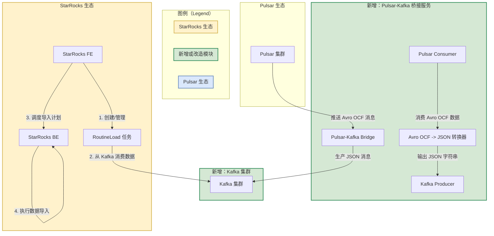
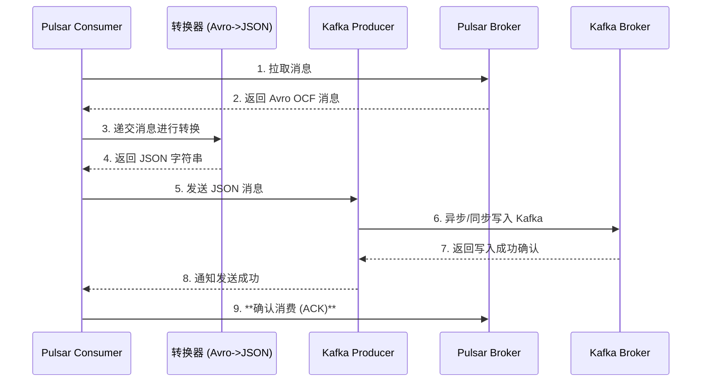

详细设计并实现一个将现有 `Pulsar -> StreamLoad` 方案改造为 `Pulsar -> Kafka Bridge -> RoutineLoad` 的新方案。

### 问题根源分析：为什么 `Pulsar -> StreamLoad` 方案存在瓶颈

在详细设计新方案之前，我们先深入分析当前架构的技术冲突和瓶颈，这有助于我们理解新方案设计的必要性。

1.  **强耦合与单点故障**：当前的实现（很可能是一个自定义的服务或脚本）是数据流中的一个**主动推送**环节。这个服务需要自己管理 Pulsar 的消费、数据格式转换、攒批、调用 `StreamLoad` HTTP 接口、处理异常和重试。这个服务本身成为了一个**单点故障**（Single Point of Failure），一旦它宕机，整条数据链路中断，且难以实现精确一次（Exactly-once）或至少一次（At-least-once）的消费保障。

2.  **吞吐与延迟的矛盾**：`StreamLoad` 是一个同步的、事务性的导入方式。

      * **为了低延迟**：您可能会选择来一条数据就推送一次，但这会产生大量小的 `StreamLoad` 任务，给 StarRocks FE 带来巨大压力，整体吞吐量极低。
      * **为了高吞吐**：您需要自己实现复杂的攒批逻辑（比如每秒或每10MB数据提交一次），这增加了代码复杂性和内存消耗，并牺牲了数据的实时性。

3.  **无原生反压机制**：如果 StarRocks 后端因为 Compaction、查询压力等原因变慢，`StreamLoad` 的 HTTP 请求会超时或失败。您的自定义服务需要处理这些异常，但缺乏一个优雅的反压（Backpressure）机制。通常结果是服务不断重试，消耗大量资源，甚至内存溢出而崩溃。

4.  **运维复杂度高**：您需要独立维护、监控、部署和扩展这个自定义的数据同步服务，这带来了额外的运维成本。

相比之下，StarRocks 的 `RoutineLoad` 是一个**原生拉取**模型，它从 StarRocks 内部主动、持续地从消息队列（如 Kafka）拉取数据，上述所有问题都由 StarRocks 自身闭环解决。

-----

### **详细设计**

核心目标是搭建一个桥梁，将 Pulsar 的数据流无缝对接到 Kafka 的生态中，从而利用 `RoutineLoad` 的所有优势。

#### **1. 架构图**

新方案的核心是引入一个“Pulsar-to-Kafka Bridge”服务，它作为数据中转站。



**架构解读**：

1.  **Pulsar-Kafka Bridge**：这是一个独立的、高可用的服务。它的职责非常单一：

      * 作为 **Pulsar Consumer**，从指定的 Pulsar Topic 消费 Avro OCF 格式的数据。
      * 内置一个**转换器**，将二进制的 Avro OCF 数据解码，并转换为 JSON 字符串格式。这是关键一步，因为 StarRocks 的 `RoutineLoad` 对接 Kafka 时，使用 JSON 格式最为灵活。
      * 作为 **Kafka Producer**，将转换后的 JSON 数据写入到指定的 Kafka Topic。

2.  **Kafka 集群**：作为数据缓冲区，是连接桥接服务和 StarRocks 的枢纽。它提供了强大的削峰填谷和数据持久化能力。

3.  **StarRocks RoutineLoad**：一旦数据进入 Kafka，我们就可以创建一个 `RoutineLoad` 任务。StarRocks 会像消费原生 Kafka 数据一样，自动、持续地从 Kafka Topic 拉取数据并导入表中，同时自动管理消费位点（Offset）。

#### **2. 桥接服务（Pulsar-Kafka Bridge）设计要点**

  * **语言选型**：为了满足“资源消耗少，性能最优”的要求，我们选择 **Go** 语言。

      * **高性能**：Go 拥有原生的并发模型（Goroutines）和高效的网络库，非常适合开发高吞O的网络服务。
      * **资源消耗少**：Go 的编译产物是静态二进制文件，无虚拟机依赖，内存占用远低于 Java 等语言。
      * **生态完善**：Pulsar 和 Kafka 都有成熟的官方或社区 Go 客户端库。

  * **核心逻辑与数据流**



**关键设计：** 第 **9** 步，**必须**在数据成功写入 Kafka 并收到确认后，才向 Pulsar ACK 这条消息。这确保了**至少一次（At-least-once）** 的数据投递语义。如果服务在第8步和第9步之间崩溃，重启后会从 Pulsar 重新消费这条未被 ACK 的消息，数据不会丢失。

  * **配置化与部署**：

      * 所有连接信息（Pulsar 服务地址、Topic、订阅名、Kafka Brokers、Topic 等）都应通过配置文件（如 `config.yml`）管理。
      * 服务应打包成 Docker 镜像，通过 Kubernetes 或其他容器编排系统进行部署，便于水平扩展和高可用。

  * **水平扩展**：

      * Pulsar 的订阅类型选择 `Key_Shared` 或 `Shared`。
      * 启动多个桥接服务实例，它们会共同消费同一个 Pulsar Topic 的数据，消费能力可以线性扩展。

#### **3. StarRocks RoutineLoad 任务设计**

在数据成功进入 Kafka Topic（例如 `pulsar_to_sr_topic`）后，创建 `RoutineLoad` 任务。

```sql
CREATE ROUTINE LOAD my_db.my_pulsar_load ON my_starrocks_table
COLUMNS TERMINATED BY ",", -- CSV格式，这里用作占位，因为我们用JSON
PROPERTIES (
    "format" = "json",
    -- 根据你的JSON结构，使用 jsonpaths 提取字段
    -- 假设JSON为: {"user_id": 1, "event_time": "2025-07-30 22:45:00", "payload": "..."}
    "jsonpaths" = "[\"$.user_id\", \"$.event_time\", \"$.payload\"]"
) 
FROM KAFKA (
    "kafka_broker_list" = "kafka-broker1:9092,kafka-broker2:9092",
    "kafka_topic" = "pulsar_to_sr_topic",
    -- 其他kafka配置，如消费组、初始位点等
    "kafka_partitions" = "0,1,2,3",
    "property.kafka_default_offsets" = "OFFSET_BEGINNING" 
);
```

**设计要点**：

  * `"format" = "json"`：明确指定数据源格式为 JSON。
  * `"jsonpaths"`：提供 JSON 字段到 StarRocks 表列的映射关系，非常灵活。

-----

### **完整代码实现 (Go, 非常简单)**

以下是 `Pulsar-Kafka Bridge` 服务的完整、可运行的 Go 代码实现。

#### **1. 项目结构**

```
pulsar-kafka-bridge/
├── go.mod
├── go.sum
├── config.yml           # 配置文件
└── main.go              # 主程序
```

#### **2. `go.mod` 文件**

首先，初始化 Go模块并获取依赖。

```bash
go mod init pulsar-kafka-bridge
go get github.com/apache/pulsar-client-go/pulsar
go get github.com/segmentio/kafka-go
go get github.com/linkedin/goavro/v2
go get gopkg.in/yaml.v3
go get golang.org/x/exp/slog
```

`go.mod` 文件内容如下：

```mod
module pulsar-kafka-bridge

go 1.21

require (
	github.com/apache/pulsar-client-go/pulsar v0.12.1
	github.com/linkedin/goavro/v2 v2.12.0
	github.com/segmentio/kafka-go v0.4.47
	golang.org/x/exp/slog v0.0.0-20231006140011-7918f672742d
	gopkg.in/yaml.v3 v3.0.1
)

// ... 其他间接依赖
```

#### **3. `config.yml` 文件**

```yaml
pulsar:
  url: "pulsar://localhost:6650"
  topic: "persistent://public/default/source-topic"
  subscription: "bridge-sub"

kafka:
  brokers:
    - "localhost:9092"
  topic: "destination-topic-for-sr"

# Bridge服务的并发设置
concurrency: 10
```

#### **4. `main.go` 完整代码**

```go
package main

import (
	"context"
	"encoding/json"
	"fmt"
	"os"
	"os/signal"
	"sync"
	"syscall"
	"time"

	"github.com/apache/pulsar-client-go/pulsar"
	"github.com/linkedin/goavro/v2"
	"github.com/segmentio/kafka-go"
	"golang.org/x/exp/slog"
	"gopkg.in/yaml.v3"
)

// Config 定义了应用的配置结构
type Config struct {
	Pulsar struct {
		URL          string `yaml:"url"`
		Topic        string `yaml:"topic"`
		Subscription string `yaml:"subscription"`
	} `yaml:"pulsar"`
	Kafka struct {
		Brokers []string `yaml:"brokers"`
		Topic   string   `yaml:"topic"`
	} `yaml:"kafka"`
	Concurrency int `yaml:"concurrency"`
}

// loadConfig 从文件加载配置
func loadConfig(path string) (*Config, error) {
	data, err := os.ReadFile(path)
	if err != nil {
		return nil, fmt.Errorf("failed to read config file: %w", err)
	}

	var cfg Config
	if err := yaml.Unmarshal(data, &cfg); err != nil {
		return nil, fmt.Errorf("failed to unmarshal config yaml: %w", err)
	}
	return &cfg, nil
}

// AvroOCFToJSONs 将 Avro OCF 二进制数据转换为一个或多个 JSON 字符串
// OCF 文件可以包含多个数据块，每个块有多条记录
func AvroOCFToJSONs(data []byte) ([][]byte, error) {
	ocf, err := goavro.NewOCFReader(bytes.NewReader(data))
	if err != nil {
		return nil, fmt.Errorf("could not create ocf reader: %w", err)
	}

	var results [][]byte
	for ocf.Scan() {
		record, err := ocf.Read()
		if err != nil {
			// 如果只是单个记录读取失败，可以选择跳过
			slog.Error("failed to read single record from OCF", "error", err)
			continue
		}

		// 将 Avro 记录转换为 JSON
		jsonRecord, err := json.Marshal(record)
		if err != nil {
			slog.Error("failed to marshal avro record to json", "error", err, "record", record)
			continue
		}
		results = append(results, jsonRecord)
	}

	if err := ocf.Err(); err != nil {
		return nil, fmt.Errorf("ocf scanning finished with an error: %w", err)
	}
	
	if len(results) == 0 {
		return nil, fmt.Errorf("no valid records found in OCF data")
	}

	return results, nil
}

func main() {
	// 设置结构化日志
	logger := slog.New(slog.NewJSONHandler(os.Stdout, nil))
	slog.SetDefault(logger)

	// 加载配置
	cfg, err := loadConfig("config.yml")
	if err != nil {
		slog.Error("failed to load configuration", "error", err)
		os.Exit(1)
	}
	slog.Info("configuration loaded successfully")

	// 创建 Pulsar Client
	pulsarClient, err := pulsar.NewClient(pulsar.ClientOptions{
		URL:               cfg.Pulsar.URL,
		OperationTimeout:  30 * time.Second,
		ConnectionTimeout: 30 * time.Second,
	})
	if err != nil {
		slog.Error("could not instantiate pulsar client", "error", err)
		os.Exit(1)
	}
	defer pulsarClient.Close()
	slog.Info("pulsar client created")

	// 创建 Kafka Producer
	// 使用 segmentio/kafka-go，它性能优异且易于使用
	kafkaWriter := &kafka.Writer{
		Addr:         kafka.TCP(cfg.Kafka.Brokers...),
		Topic:        cfg.Kafka.Topic,
		Balancer:     &kafka.LeastBytes{},
		RequiredAcks: kafka.RequireOne, // 至少一个 leader 副本确认
		Async:        false,            // 设置为同步发送，确保消息一定送达再 ACK Pulsar
	}
	defer kafkaWriter.Close()
	slog.Info("kafka writer created")

	// 创建 Pulsar Consumer
	consumer, err := pulsarClient.Subscribe(pulsar.ConsumerOptions{
		Topic:            cfg.Pulsar.Topic,
		SubscriptionName: cfg.Pulsar.Subscription,
		Type:             pulsar.Shared, // 使用 Shared 类型允许多个实例并发消费
		MessageChannel:   make(chan pulsar.ConsumerMessage, cfg.Concurrency*2),
	})
	if err != nil {
		slog.Error("could not subscribe to pulsar topic", "error", err)
		os.Exit(1)
	}
	defer consumer.Close()
	slog.Info("subscribed to pulsar topic", "topic", cfg.Pulsar.Topic, "subscription", cfg.Pulsar.Subscription)

	// 设置优雅关闭
	ctx, cancel := context.WithCancel(context.Background())
	defer cancel()
	signals := make(chan os.Signal, 1)
	signal.Notify(signals, syscall.SIGINT, syscall.SIGTERM)

	go func() {
		sig := <-signals
		slog.Info("received shutdown signal", "signal", sig)
		cancel()
	}()
	
	var wg sync.WaitGroup
	// 启动并发 Worker 处理消息
	for i := 0; i < cfg.Concurrency; i++ {
		wg.Add(1)
		go func(workerID int) {
			defer wg.Done()
			slog.Info("starting worker", "id", workerID)
			for {
				select {
				case <-ctx.Done():
					slog.Info("stopping worker", "id", workerID)
					return
				case cm := <-consumer.Chan():
					msg := cm.Message
					processMessage(ctx, kafkaWriter, msg, consumer)
				}
			}
		}(i)
	}

	slog.Info("bridge service started, waiting for messages...")
	wg.Wait()
	slog.Info("all workers stopped, bridge service shut down gracefully")
}

// processMessage 是核心处理函数
func processMessage(ctx context.Context, writer *kafka.Writer, msg pulsar.Message, consumer pulsar.Consumer) {
	// 1. 将 Avro OCF 数据转换为多条 JSON 数据
	jsonRecords, err := AvroOCFToJSONs(msg.Payload())
	if err != nil {
		slog.Error("failed to convert avro to json, nacking message", "msgId", msg.ID(), "error", err)
		// Nack 使消息能被重新消费，避免数据丢失
		consumer.Nack(msg)
		return
	}
    slog.Info("successfully converted message", "msgId", msg.ID(), "recordCount", len(jsonRecords))

	// 2. 将转换后的 JSON 逐条写入 Kafka
	var kafkaMessages []kafka.Message
	for _, record := range jsonRecords {
		kafkaMessages = append(kafkaMessages, kafka.Message{
			Value: record,
		})
	}
	
	// 使用 WriteMessages 进行批量写入以提升性能
	err = writer.WriteMessages(ctx, kafkaMessages...)
	if err != nil {
		slog.Error("failed to write message to kafka, nacking pulsar message", "msgId", msg.ID(), "error", err)
		// 写入 Kafka 失败，Nack Pulsar 消息
		consumer.Nack(msg)
		return
	}

	// 3. **关键步骤**: 确认 Kafka 写入成功后，才 ACK Pulsar 消息
	consumer.Ack(msg)
	slog.Info("successfully processed and acked message", "msgId", msg.ID())
}

```

#### **5. 如何运行**

1.  确保您的环境中 Pulsar 和 Kafka 正在运行。
2.  将 `main.go` 和 `config.yml` 放在同一目录下。
3.  根据您的环境修改 `config.yml` 文件。
4.  在终端中运行：`go run main.go`
5.  要构建二进制文件：`go build -o pulsar-bridge`，然后直接运行 `./pulsar-bridge`。

这个方案和代码实现提供了一个高性能、高可用、资源占用低的桥梁，将 Pulsar 的数据流平滑地过渡到 StarRocks `RoutineLoad` 所支持的 Kafka 生态，彻底解决了原有 `StreamLoad` 方案的瓶颈。